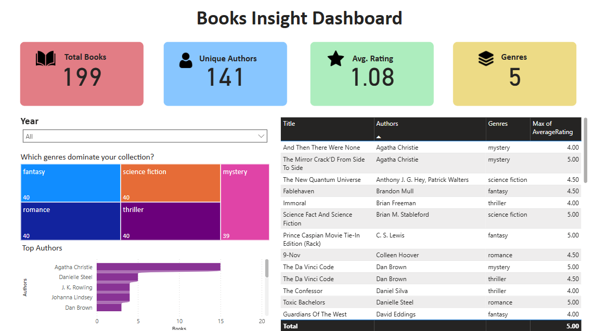

# 📚 Books Data Pipeline & Power BI Dashboard

An end-to-end project that extracts book data from the Google Books API, loads it into Azure SQL Database using Airflow, transforms it, and visualizes it in Power BI.

---

## 🗓️ Project Timeline

- **Started**: April 2025  
- **Completed**: June 2025  

---

## 📌 Project Overview

This project demonstrates a full-stack data engineering workflow:
- 📦 Data ingestion with **Airflow on Docker**
- 🧠 Transformation with **Python + Pandas**
- ☁️ Storage in **Azure SQL Database**
- 📊 Interactive dashboard built with **Power BI**

---

## 🔧 Technologies Used

| Component         | Stack                          |
|------------------|---------------------------------|
| Orchestration    | Apache Airflow (Docker)         |
| Data Source      | Google Books API                |
| ETL Scripts      | Python (requests, pyodbc,pandas)|
| Database         | Azure SQL Database              |
| Transformation   | Airflow DAG + Pandas            |
| Visualization    | Power BI Desktop                |

---

## 📊 Dashboard Features

- 📚 Total Books, Unique Authors, Average Rating , Genres
- 🌟 Top Authors
- 📈 Filter Trend by Year
- 🏷️ Genre Distribution
- 🔍 Interactive filters (Genre, Year, Author)

---

## 🛠️ How It Works

1. **Ingestion DAG** fetches books by genre daily from the Google Books API and inserts into Azure SQL.
2. **Transformation DAG** cleans and formats the data (e.g., extracts year, normalizes ratings).
3. Power BI connects directly to the transformed table in Azure SQL.
4. Dashboard updates when new data is ingested.

---

## 📁 Folder Breakdown

- `/dags/` — Airflow DAGs for ingestion and transformation
- `/powerBI/` — Power BI `.pbix` file and screenshots
- `/docker/` — Dockerfiles and setup (if used)
- `requirements.txt` — Python packages used

---

## 🚀 How to Reproduce

1. Clone this repo  
2. Set up Azure SQL and Google Books API access  
3. Run Airflow via Docker Compose  
4. Load Power BI `.pbix` and update credentials  
5. Explore the dashboard!

---

## 🧠 What I Learned

- Designing DAGs for real-world ingestion
- Connecting Airflow with Azure SQL
- Using pandas for defensive transformations
- Structuring data projects for deployment
- Creating clean, insightful dashboards in Power BI

---

## 📬 Contact

If you'd like to collaborate or discuss improvements:
- ✉️ nairsiddhi01.ofc@gmail.com
- 💼 https://www.linkedin.com/in/siddhi-nair02/

---

## 📄 License

MIT – use freely with attribution.
